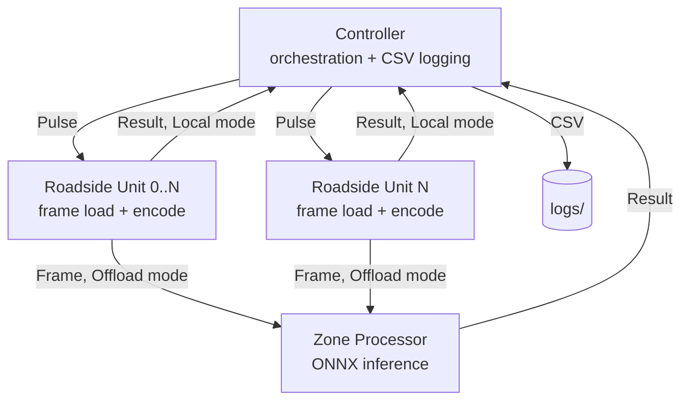
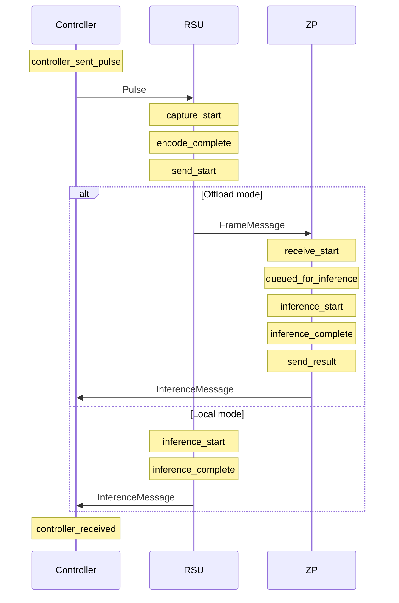

# Rust Traffic Watch

A distributed edge-computing testbed for evaluating real-time traffic monitoring pipelines. A controller orchestrates one or more Roadside Units (RSUs) and optionally a Zone Processor (ZP), runs YOLOv5 object detection via ONNX Runtime, and records microsecond-precision timing across the full capture→encode→transmit→infer path to CSV.

The system is built to answer a research question: how do codec choice, quality tier, resolution, model size, and the local-vs-offloaded split affect end-to-end latency and throughput on constrained edge hardware?

## Citation

This repository is the reference implementation for:

> Walcher, R., Horvath, K., Kimovski, D. & Kitanov, S. (2025). *Wi-Fi Enabled Edge Intelligence Framework for Smart City Traffic Monitoring using Low-Power IoT Cameras*. In Proceedings of the 1st International Workshop on Intelligent and Scalable Systems across the Computing Continuum (ScaleSys 2025), IoT Workshop Proceedings, 1(1), 43–49. <https://doi.org/10.34749/3061-1008.2025.7>

```bibtex
@inproceedings{walcher2025wifi,
  author    = {Walcher, Raphael and Horvath, Kurt and Kimovski, Dragi and Kitanov, Stojan},
  title     = {Wi-Fi Enabled Edge Intelligence Framework for Smart City Traffic Monitoring using Low-Power IoT Cameras},
  booktitle = {Proceedings of the 1st International Workshop on Intelligent and Scalable Systems across the Computing Continuum (ScaleSys 2025)},
  series    = {IoT Workshop Proceedings},
  volume    = {1},
  number    = {1},
  pages     = {43--49},
  year      = {2025},
  doi       = {10.34749/3061-1008.2025.7},
  publisher = {Institute of Information Systems Engineering, TU Wien},
  issn      = {3061-1008}
}
```

The exact state of the codebase at the time of the paper's submission is preserved under the git tag [`workshop_paper_cutoff`](../../tree/workshop_paper_cutoff). `main` continues to evolve with thesis work, so check out that tag to reproduce the paper's results.

## Architecture



| Component | Role |
|---|---|
| **Controller** | Accepts device connections, pushes `ExperimentConfig`, emits pulses at the target FPS, collects `InferenceMessage`s, streams results to CSV. |
| **Roadside Unit (RSU)** | On each pulse, loads a pre-encoded frame from disk. In Local mode, runs inference itself and returns the result. In Offload mode, forwards the `FrameMessage` to the Zone Processor. |
| **Zone Processor (ZP)** | Accepts frames from all RSUs, runs ONNX inference on a shared `InferenceManager` with round-robin fairness across RSUs, returns results to the controller. Currently a single ZP instance (`ZoneProcessor(0)`); multi-ZP is a TODO in `controller/src/service.rs`. |

Message framing is length-prefixed postcard over TCP (`crates/network/src/framing.rs`). The shared wire types live in `crates/protocol`.

## Timing pipeline

Every `TimingMetadata` record carries up to eleven timestamps. Which ones are populated depends on the mode:



Derived metrics (`total_latency`, `rsu_overhead`, `network_latency`, `zp_processing`, `zp_queueing`, `inference_time`) are computed on the controller side and written alongside the raw timestamps to `logs/experiment_{id}_{YYYYMMDD_HHMMSS}.csv`.

## Repository layout

```
rust-traffic-watch/
├── services/
│   ├── controller/        # orchestration, pulse generator, CSV writer
│   ├── roadside-unit/     # edge device: frame loader + optional local inference
│   └── zone-processor/    # shared inference node for offload mode
├── crates/
│   ├── inference/         # ONNX Runtime wrapper + round-robin InferenceManager
│   ├── network/           # framing + connection helpers
│   └── protocol/          # wire types, config constants, timing struct
├── tools/
│   ├── preprocessor/      # bulk-encode source images to {resolution}/{codec}/{tier}
│   ├── model-tester/      # quick inference sanity check on a single image
│   └── showcase/          # Axum web UI that streams annotated frames live
└── models/                # YOLOv5 *.onnx files, tracked via git LFS
```

## Quick start

Prerequisites: Rust (edition 2024, i.e. a reasonably recent stable toolchain), `git-lfs` for the model weights, and the ONNX Runtime shared libs — `ort` with `copy-dylibs` pulls these in on build. Encoded frame data is expected at `services/roadside-unit/testImages/{FHD,HD,640}/{jpg,png,webp}/seq3-drone_{NNNNNNN}_{T1|T2|T3}.{ext}`.

```bash
git clone <your-remote>/rust-traffic-watch.git
cd rust-traffic-watch
git lfs pull
cargo build --release
```

To generate the encoded frame hierarchy from raw images:

```bash
cargo run --release --bin preprocessor -- <input_directory>
```

This writes all combinations of resolution × codec × tier into `services/roadside-unit/testImages/`.

## Running experiments

The controller uses clap subcommands. All subcommands accept the global `--local-only` / `--remote-only` flags to restrict the mode sweep (default: both).

```bash
# One specific config
cargo run --release --bin controller -- single --model yolov5n --fps 5 --rsu-count 2 --duration 30

# Smoke test: yolov5n, jpg/T2/FHD, fps 1 and 10, both modes, 2 RSUs, 10s each
cargo run --release --bin controller -- quick

# Full sweep: 3 models × 4 fps × 3 codecs × 3 tiers × 3 resolutions × {local,offload}, 3 RSUs, 60s each
cargo run --release --bin controller -- full

# Custom: fix model/fps/rsus/duration, sweep codec × tier × resolution × mode
cargo run --release --bin controller -- custom --model yolov5s --fps 10 --rsu-count 3 --duration 60
```

On each RSU host:

```bash
cargo run --release --bin roadside-unit -- --id <distinct number>
```

And, for Offload mode, on the ZP host:

```bash
cargo run --release --bin zone-processor -- --id <distinct number>
```

RSUs and the ZP reconnect automatically between experiments, so you can start them once and leave them running while the controller iterates through a suite.

### Controller CLI reference

| Subcommand | What it sweeps | Defaults |
|---|---|---|
| `single` | nothing (one run) | `--model yolov5n --fps 1 --rsu-count 1 --duration 10`, JPEG T2 FHD |
| `quick`  | fps ∈ {1, 10}, modes | yolov5n, JPEG T2 FHD, 2 RSUs, 10s |
| `full`   | model × fps × codec × tier × resolution × mode | 3 models, fps ∈ {1, 5, 10, 15}, 3 codecs, 3 tiers, 3 resolutions, 3 RSUs, 60s |
| `custom` | codec × tier × resolution × mode | fixes model/fps/rsus/duration via flags |

Global: `--local-only`, `--remote-only`.

## Configuration

Network endpoints and defaults live in `crates/protocol/src/config.rs`. Current values:

```rust
pub const CONTROLLER_ADDRESS: &str = "10.0.0.60";
pub const ZONE_PROCESSOR_ADDRESS: &str = "10.0.0.30";
pub const CONTROLLER_PORT: u16 = 9090;
pub const ZONE_PROCESSOR_PORT: u16 = 9092;

pub const SOURCE_FPS: u64 = 30;                      // `fixed_fps` must divide this
pub const JPEG_QUALITY: [u8; 3] = [90, 75, 60];      // [T1, T2, T3]
pub const PNG_ZLIB_LEVEL: [u8; 3] = [6, 3, 1];
pub const WEBP_LOSSY_QUALITY: [f32; 3] = [90.0, 75.0, 60.0];
pub const WEBP_LOSSLESS_METHOD: [i32; 3] = [6, 3, 0];
```

Change these to match your deployment before building. There's no runtime override — it's a research testbed, not a product.

## Inference

`crates/inference` wraps `ort` 2.0-rc.10 and exposes two layers:

- `OnnxDetector` in `engine.rs` — one-shot `detect(image_bytes) -> InferenceResult`, handles letterbox preprocessing, YOLO output parsing, class filtering (`person, bicycle, car, motorcycle, bus, truck`), NMS, and coordinate rescaling back to original image space.
- `InferenceManager` in `inference_manager.rs` — owns a persistent `OnnxDetector` on a dedicated Tokio task, maintains a per-RSU pending-frame slot, and round-robins across RSUs so no one RSU can starve the others. Used by both the ZP (centralised inference) and by the RSU itself in Local mode.

Session is built with `intra_threads(2)`, `inter_threads(1)`, and `GraphOptimizationLevel::Level1`. The `ort` crate is compiled with `openvino`, `tensorrt`, and `cuda` execution providers enabled in `crates/inference/Cargo.toml`; whether they're actually used depends on which runtime libraries are present on the host.

## Showcase tool

`tools/showcase` is a standalone Axum web app that loops through the encoded frame set, runs inference, annotates detections, and serves a live view at `http://<host>:6767/`. Useful for demos — no controller or network coordination involved.

```bash
cd tools/showcase
cargo run --release -- --model yolov5n --resolution hd --codec jpg --tier t2 --fps 10
```

## Code style

`.cargo/config.toml` sets `-Wclippy::pedantic -Wclippy::nursery -Dwarnings` workspace-wide, so `cargo build` will fail on any lint. `rustfmt.toml` uses edition 2024, `max_width = 100`, `imports_granularity = "Crate"`, `group_imports = "StdExternalCrate"`.

## Known limitations

- Frames are pre-encoded and loaded from disk — no live camera capture path.
- TCP only; no UDP / QUIC streaming.
- Single ZP instance. Multi-ZP requires changing the `DeviceId::ZoneProcessor(0)` hardcoding in `controller/src/service.rs::establish_connections` and adding routing logic for which frames go where.
- Detection classes are hardcoded to the COCO vehicle/person subset in `engine.rs`.
- `ExperimentMode` affects the wire protocol but not the model — same ONNX file runs in both modes.

## Acknowledgments

The traffic footage used for evaluation in the associated paper is not redistributed in this repository. It comes from the **Multi-View Traffic Intersection Dataset (MTID)** by Jensen, Møgelmose, and Moeslund — thanks to the authors for making it publicly available:

> Jensen, M. B., Møgelmose, A., & Moeslund, T. B. (2020). Presenting the Multi-View Traffic Intersection Dataset (MTID): A Detailed Traffic-Surveillance Dataset. In *IEEE 23rd International Conference on Intelligent Transportation Systems 2020*. <https://doi.org/10.1109/ITSC45102.2020.9294694>

Dataset mirror: <https://www.kaggle.com/datasets/andreasmoegelmose/multiview-traffic-intersection-dataset>

## License

Source code is licensed under the Apache License 2.0 — see [`LICENSE`](./LICENSE).

Third-party assets that ship or may ship in this repository carry their own licenses:

- **YOLOv5 ONNX weights** under `models/` (tracked via git LFS) are derived from [Ultralytics YOLOv5](https://github.com/ultralytics/yolov5), licensed **AGPL-3.0**. This applies to the weight files only, not to the Rust code in this repository.
- **Roboto-Thin.ttf** under `tools/model-tester/fonts/` is licensed under the **Apache License 2.0** by Google.
- Rust crate dependencies are under their respective permissive licenses (see `Cargo.lock`).

The training/evaluation dataset is **not** included in this repository and is not covered by this license.
