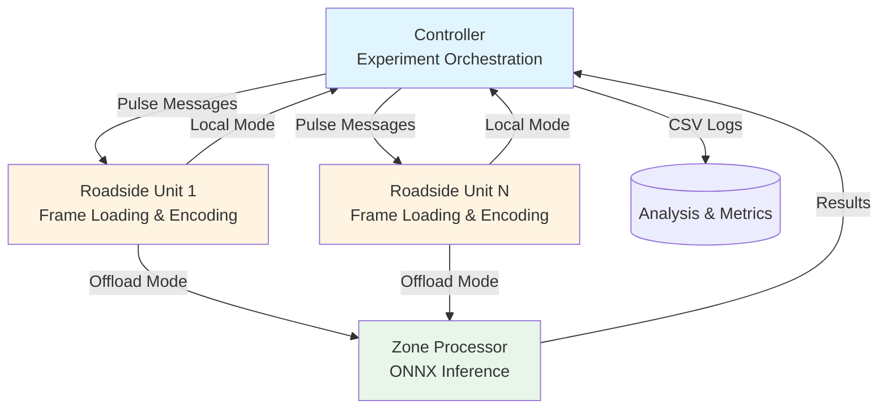
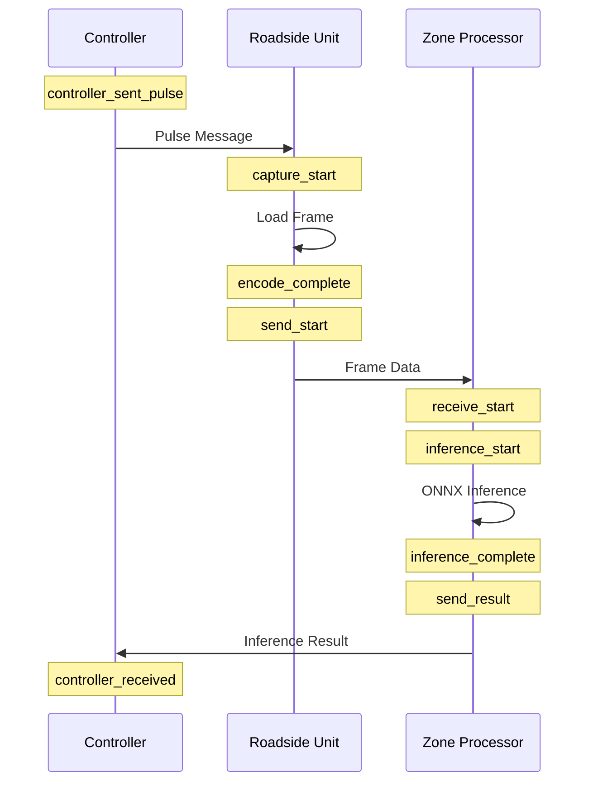

# Rust Traffic Watch

> A high-performance distributed edge computing system for real-time traffic monitoring using YOLO object detection and
> Rust-native ONNX Runtime inference

[](https://www.rust-lang.org/)
[](https://onnxruntime.ai/)
[](https://github.com/ultralytics/yolov5)

## Overview

**Rust Traffic Watch** is a research-grade distributed system for evaluating edge computing performance in real-time
traffic monitoring scenarios. The system coordinates multiple edge devices to process video frames with YOLO object
detection, supporting both local and offloaded inference workloads with comprehensive performance instrumentation.

### Key Features

- **Pure Rust Inference**: ONNX Runtime integration for high-performance CPU-based object detection
- **Distributed Architecture**: Controller orchestrates multiple Roadside Units (RSUs) and Zone Processors (ZPs)
- **Flexible Deployment**: Local inference on edge devices or offload to compute nodes
- **Image Codec Evaluation**: Support for JPEG, PNG, and WebP with configurable quality tiers
- **Comprehensive Benchmarking**: Microsecond-precision timing across the entire processing pipeline
- **Research-Ready**: Automated experiment orchestration with CSV export for analysis

## Architecture



### Component Roles

| Component               | Description                               | Key Responsibilities                                                                                                                              |
|-------------------------|-------------------------------------------|---------------------------------------------------------------------------------------------------------------------------------------------------|
| **Controller**          | Experiment coordinator and data collector | • Sends timing pulses to RSUs<br/>• Collects inference results<br/>• Generates CSV performance logs<br/>• Manages experiment lifecycle            |
| **Roadside Unit (RSU)** | Edge device simulating camera node        | • Loads pre-encoded frames from disk<br/>• Performs local ONNX inference (Local mode)<br/>• Forwards frames to Zone Processor (Offload mode)<br/> |
| **Zone Processor (ZP)** | Compute node for offloaded inference      | • Receives frames from RSUs<br/>• Performs ONNX inference<br/>• Returns results to Controller<br/>                                                |

## Performance Metrics

The system captures microsecond-precision timestamps across the entire pipeline:

### Timing Breakdown



### Measured Latencies

- **Total Latency**: End-to-end from controller pulse to result receipt
- **RSU Overhead**: Frame loading and encoding time
- **Network Latency**: Transmission time (offload mode only)
- **Inference Time**: Object detection processing time
- **ZP Overhead**: Total zone processor handling time (offload mode only)

### CSV Output Format

Experiment results are exported to `logs/experiment_{id}_{timestamp}.csv` with:

- Raw timestamps (microseconds since UNIX epoch)
- Computed latencies (microseconds)
- Detection metadata (count, bounding boxes, confidence)
- Experiment configuration (codec, tier, resolution, model)

## Project Structure

```
rust-traffic-watch/
├── services/
│   ├── controller/          # Experiment orchestration service
│   ├── roadside-unit/       # Edge device simulator (RSU)
│   └── zone-processor/      # Inference compute node (ZP)
├── crates/
│   ├── inference/           # ONNX Runtime engine and manager
│   ├── network/             # TCP connection and message framing
│   └── protocol/            # Shared types and configuration
├── tools/
│   ├── preprocessor/        # Frame encoding utility
│   └── model-tester/        # ONNX model validation
└── logs/                    # Experiment CSV outputs
```

## Quick Start

### Prerequisites

- Rust 1.75+ (Edition 2024)
- ONNX models in `models/` directory (`.onnx` format)
- Pre-encoded frames in `services/roadside-unit/testImages/`

### Building

```bash
git clone https://github.com/rawalcher/rust-traffic-watch.git
cd rust-traffic-watch
cargo build --release
```

### Running a Single Experiment

```bash
# Terminal 1: Start controller
cargo run --release --bin controller -- --model=yolov5n --fps=1 --local

# Terminal 2: Start roadside unit (on same or different machine)
cargo run --release --bin roadside-unit

# For offload mode, also start zone processor:
# Terminal 3:
cargo run --release --bin zone-processor
```

### Running Automated Test Suite

```bash
# Quick test (1 model, 2 FPS values, 1 codec)
cargo run --release --bin controller -- --quick

# Full benchmark suite
cargo run --release --bin controller -- \
    --models=yolov5n,yolov5s,yolov5m \
    --fps=1,5,10 \
    --codecs=jpg,webplossy,pnglossless \
    --tiers=T1,T2,T3 \
    --duration=300
```

### Command-Line Options

| Option                     | Description                                     | Default    |
|----------------------------|-------------------------------------------------|------------|
| `--model=<n>`              | ONNX model file (without .onnx)                 | yolov5n    |
| `--fps=<values>`           | Comma-separated FPS values                      | 1,5,10     |
| `--duration=<secs>`        | Experiment duration in seconds                  | 10         |
| `--codec=<type>`           | Image codec (jpg\|png\|webplossy\|webplossless) | jpg        |
| `--tier=<T1\|T2\|T3>`      | Quality tier (T1=best, T3=fast)                 | T2         |
| `--resolution=<type>`      | Resolution (fhd\|hd\|letterbox)                 | fhd        |
| `--local`                  | Local inference only                            | Both modes |
| `--remote`                 | Offload inference only                          | Both modes |
| `--quick`                  | Quick test configuration                        | Full suite |
| `--num-roadside-units=<N>` | Number of RSUs to coordinate                    | 1          |

## Configuration

Key configuration in `crates/protocol/src/config.rs`:

```rust
pub const CONTROLLER_PORT: u16 = 9090;
pub const ZONE_PROCESSOR_PORT: u16 = 9092;

pub const CONTROLLER_ADDRESS: &str = "localhost";
pub const ZONE_PROCESSOR_ADDRESS: &str = "localhost";
pub const ROADSIDE_UNIT_ADDRESS: &str = "localhost";

// Image codec quality tiers
pub const JPEG_QUALITY: [u8; 3] = [90, 75, 60];  // [T1, T2, T3]
pub const PNG_ZLIB_LEVEL: [u8; 3] = [6, 3, 1];
pub const WEBP_LOSSY_QUALITY: [f32; 3] = [90.0, 75.0, 60.0];
```

## ONNX Inference Implementation

The system uses pure Rust ONNX Runtime for inference:

```rust
// From crates/inference/src/engine.rs
pub struct OnnxDetector {
    session: Session,
    model_name: String,
    class_names: HashMap<i64, &'static str>,
    allowed_classes: Vec<i64>,
}

// Preprocessing: letterbox resizing with padding
let (input_tensor, scale, pad_x, pad_y) = letterbox_nchw( & image, 640, false) ?;

// Inference
let outputs = self .session.run(inputs!["images" => input_ref]) ?;

// Postprocessing: NMS and coordinate rescaling
let (boxes, scores, class_ids) = parse_yolo_output(...);
let detections = rescale_detections(...);
```

Supported object classes: person, bicycle, car, motorcycle, bus, truck

## Image Preprocessing

Pre-encoded frames are stored in a structured directory hierarchy:

```
services/roadside-unit/testImages/
├── FHD/              # 1920x1080
│   ├── jpg/
│   ├── png/
│   └── webp/
├── HD/               # 1280x720
│   └── ...
└── 640/              # 640x640 letterbox
    └── ...
```

Each codec directory contains frames like: `image_name_0000001_T2.jpg`

Use the preprocessor tool to generate encoded frames:

```bash
cargo run --release --bin preprocessor <input_directory>
```

## Network Protocol

Custom binary protocol using postcard serialization:

```rust
pub enum Message {
    Hello(DeviceId),              // Initial handshake
    Frame(FrameMessage),          // Frame data with timing
    Result(InferenceMessage),     // Inference results
    Control(ControlMessage),      // Experiment control
    Pulse(TimingMetadata),        // Timing for next frame
}
```

Frame format: `[4-byte length][postcard-serialized message]`

## Development Environment

### Recommended Setup

The project was developed with NixOS flake-based configuration. For non-NixOS systems:

```bash
# Install Rust
curl --proto '=https' --tlsv1.2 -sSf https://sh.rustup.rs | sh

# Install ONNX Runtime dependencies (varies by platform)
# See: https://onnxruntime.ai/docs/build/inferencing.html
```

### Code Quality

```bash
# Run clippy with pedantic warnings
cargo clippy

# Format code
cargo fmt

# Build configuration in .cargo/config.toml
rustflags = [
    "-Wclippy::pedantic",
    "-Wclippy::nursery",
    "-Dwarnings"
]
```

## Known Limitations

- Frame data is pre-encoded and loaded from disk (not live camera capture)
- Single-threaded inference per device (configurable in ONNX session)
- TCP-based protocol (no UDP streaming option, yet)
- Limited to YOLO detection (no segmentation or pose estimation)

## License

TODO

## Acknowledgments

- ONNX Runtime for high-performance inference
- YOLOv5 by Ultralytics for object detection models
- Tokio for async runtime
- NixOS for reproducible development environments