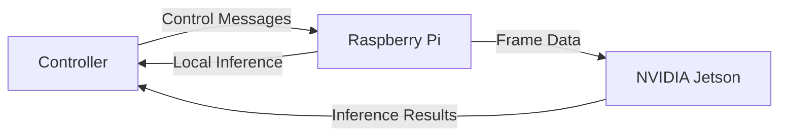

# Rust Traffic Watch

> A distributed edge computing system for real-time traffic monitoring using YOLO object detection

[](https://www.rust-lang.org/)
[](https://www.python.org/)
[](https://github.com/ultralytics/yolov5)

## Overview

**Rust Traffic Watch** demonstrates real-time traffic monitoring across heterogeneous edge devices. A Raspberry Pi captures frames, optionally performs local inference, or forwards them to an NVIDIA Jetson for accelerated processing. A controller coordinates experiments and collects performance metrics.

### Features

* Distributed workload across devices
* Local or offloaded inference
* YOLO-based real-time object detection
* PyTorch (Pi) and TensorRT (Jetson) support
* Automated benchmarking with latency analysis

## Environment

* **Controller & Raspberry Pi**: configured with [traffic-watch-fleet](https://github.com/rawalcher/traffic-watch-fleet) using **NixOS**
* **Jetson Nano**: running [Qengineering Ubuntu 20.04 image](https://github.com/Qengineering/Jetson-Nano-Ubuntu-20-image)

## Architecture



| Component           | Device         | Role                                                       |
|---------------------|----------------|------------------------------------------------------------|
| **Controller**      | Desktop/Server | Orchestrates experiments and collects results              |
| **Pi Sender**       | Raspberry Pi 4 | Captures frames, performs local inference or forwards data |
| **Jetson Receiver** | NVIDIA Jetson  | Accelerated inference                                      |

## Quick Start

```bash
git clone https://github.com/yourusername/rust-traffic-watch.git
cd rust-traffic-watch
cargo build --release
```

Start the components:

```bash
cargo run --release --bin controller
cargo run --release --bin jetson-receiver   # on Jetson
cargo run --release --bin pi-sender         # on Pi
```

Run an experiment:

```bash
cargo run --release --bin controller -- --model=yolov5s --fps=10 --local
```

Full setup instructions are available in [docs/setup.md](docs/setup.md).

## Performance Metrics

Collected metrics:

* End-to-end latency
* Processing overhead
* Network latency
* Inference time
* Detection counts

Results are written as CSV logs in `logs/`.

## Project Structure

```
rust-traffic-watch/
├── controller/          
├── pi-sender/           
├── jetson-receiver/     
├── shared/              
├── python/              
└── logs/                
```

## Research Applications

* Edge computing workload distribution
* Real-time computer vision
* IoT coordination
* Low-latency network protocols

## License

TODO